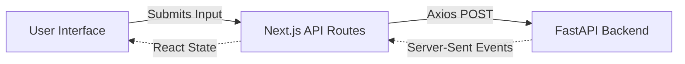

<div align="center">
  
  
  
  <h1>DevKit.AI — Interactive Frontend</h1>
  <p>The highly interactive, streaming UI for the DevKit.AI platform.</p>
</div>

---

## Overview
This repository contains the **Frontend** for DevKit.AI. Built with Next.js 14 (App Router) and Tailwind CSS, it provides the interactive, real-time user interface where users conduct their 6-phase architectural interviews with the AI Swarm.

## Architecture & Data Flow



## Core Features
- **Real-Time Streaming**: Consumes Server-Sent Events (SSE) to render the AI's thought process, architectural diagrams, and project milestones live as they are generated.
- **Dynamic Visualizations**: Utilizes custom SVG rendering (Architecture Canvas) to abstract complex backend JSON blueprints into visually stunning system maps.
- **Refinement Interface**: Allows users to dynamically patch and refine their architectural blueprints through a seamless chat interface.
- **Export Capabilities**: Renders the final JSON payloads into polished Markdown documents (Pitch Decks, Walkthroughs) that can be downloaded locally.

## Local Development

```bash
# 1. Install dependencies
npm install

# 2. Run the development server
npm run dev
```

Open [http://localhost:5173](http://localhost:5173) with your browser to see the result.
