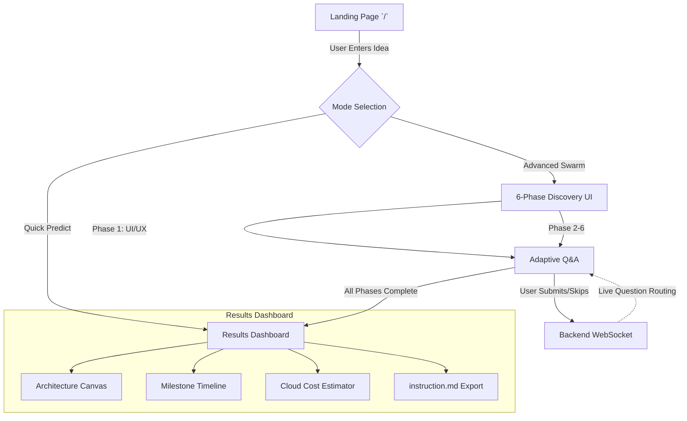

<div align="center">
  
  
  
  <h1>DevKit.AI — Frontend Interface</h1>
  <p>The interactive Command Center and Dashboard for DevKit.AI.</p>
</div>

---

## 📌 Overview
This repository contains the **Frontend** application for DevKit.AI. Built with modern web technologies, it provides a highly polished, responsive, and animated user interface that serves as the user's portal into the Multi-Agent "Second Brain."

It is responsible for capturing user intent (either through natural language prompts or uploaded UI screenshots), driving the interactive 6-Phase Discovery flow, and rendering the final generated architectural blueprints dynamically.

## 🎨 User Flow & UI Architecture



## ✨ Core Features
- **Dynamic AI Conversation UI**: Uses WebSockets to conduct a live, adaptive interview with the user. The UI automatically displays the AI's "typing" status and supports multi-modal inputs (e.g., uploading images for the Vision Agent).
- **Interactive Architecture Canvas**: Utilizes Framer Motion and custom components to render the backend's generated JSON blueprint into a visually appealing, interconnected data-flow graph.
- **Server-Sent Events (SSE) Receiver**: Hooks into the backend's `/stream/generate` endpoint to visually display the LLM Swarm's progress in real-time, preventing UI lockups.
- **In-Browser Sandboxing**: Includes a direct integration with StackBlitz WebContainers to instantly boot the generated boilerplate code directly inside the browser.
- **Radix UI Primitives**: Built on an accessible, unstyled foundation ensuring keyboard navigation, screen reader support, and robust interaction design.

## 🚀 Quick Start & Local Development

### 1. Prerequisites
- Node.js (v20+)
- npm or bun

### 2. Installation
Navigate into the `Frontend` directory and install the required dependencies:
```bash
cd Frontend
npm install
```

### 3. Environment Configuration
The frontend communicates with the FastAPI Backend. By default, it looks for the backend at `http://localhost:8000`. If your backend is hosted elsewhere, update the API URLs in the relevant configuration files (e.g., `src/lib/api.ts`).

### 4. Running the Development Server
Launch the Vite development server:
```bash
npm run dev
```
*The application will now be accessible at `http://localhost:5173`. Hot Module Replacement (HMR) is enabled for rapid UI iteration.*

### 5. Building for Production
To create an optimized production build:
```bash
npm run build
```
The output will be placed in the `dist/` directory, ready to be deployed to Vercel, Netlify, or your preferred static hosting provider.

---

## 📁 Directory Structure
- `/src/components/` — Reusable React components (Animated backgrounds, Phase Bars, Architecture Canvases).
- `/src/routes/` — Page-level routing logic via `@tanstack/react-router`.
- `/src/lib/` — API clients, WebSocket handlers, and Zustand state stores.
- `/src/hooks/` — Custom React hooks (e.g., for parsing SSE streams).
- `/public/` — Static assets (fonts, images).
